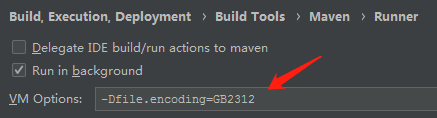

> 当前位置：【Java】13_Tools（工具）-> 13.2_BuildTools（项目构建工具） -> 01_Maven

# 第一章 Maven 下载安装和配置

## 0、Maven 下载

- Maven 官网：https://maven.apache.org

  

## 1、Docker - Maven 安装和配置


## 2、Linux 系统 - Maven 安装和配置

### 步骤1：下载

- 地址：https://maven.apache.org/download.cgi

### 步骤2：配置环境变量

```bash
# 解压
cd /usr/local/
tar -zxvf apache-maven-3.8.4-bin.tar.gz

# 配置环境变量
vi /etc/profile
export MAVEN_HOME=/usr/local/apache-maven-3.8.4
export PATH=$PATH:$MAVEN_HOME/bin

# 刷新配置文件
source /etc/profile

# 测试是否安装成功
mvn -v
```


## 3、Win系统 -  Maven 安装和配置

### 步骤1：解压

### 步骤2：配置环境变量

```bash
# 新建系统变量
MAVEN_HOME
maven安装地址

# 系统变量 - Path变量
%MAVEN_HOME%\bin
```


## 4、Mac系统 -  Maven 安装和配置

- 修改本地仓库默认路径

# 第二章 Maven 使用

## 1、maven 镜像地址

```xml
<mirror> 
    <id>alimaven</id> 
    <name>aliyun maven</name> 
    <url>http://maven.aliyun.com/nexus/content/groups/public/</url> 
    <mirrorOf>central</mirrorOf> 
</mirror>
```


## 2、常见命令

```bash
# 将 maven 依赖树导出到 D:/tree.txt
mvn dependency:tree -Doutput=D:/tree.txt
```

# 第三章 Maven 私服 \- Sonatype Nexus

## 1、Nexus - 仓库类型

- hosted（宿主仓库）
  - 宿主仓库主要用于存放项目部署的构件、或者第三方构件用于提供下载。

- proxy（代理仓库）
  - 代理仓库就是对远程仓库的一种代理，从远程仓库下载构件和插件然后缓存在Nexus仓库中

- group（仓库组）
  - 仓库的一种组合策略，并不存在实在意义的依赖，只是作为一种中转站的作用存在

- virtual（虚拟仓库）
  - 用于适配 Maven 1

## 2、 Nexus - 内置仓库类型

- maven-central：代理中央仓库、策略为Release、只会下载和缓存中央仓库中的发布版本构件。

- maven-releases：策略为Release的宿主仓库、用来部署组织内部的发布版本内容。

- maven-snapshots：策略为Snapshot的宿主仓库、用来部署组织内部的快照版本内容。

- maven-public：该仓库将上述所有策略为Release的仓库聚合并通过一致的地址提供服务。

- nuget-hosted：用来部署nuget构件的宿主仓库

- nuget.org-proxy：代理nuget远程仓库，下载和缓冲nuget构件。

- nuget-group：该仓库组将nuget-hosted与nuget.org-proxy仓库聚合并通过一致的地址提供服务。

- maven-public：该仓库组将maven-central，maven-releases与maven-snapshots仓库聚合并通过一致的地址提供服务

## 3、本地 Maven 连接私服的配置

### 步骤1：settings.xml 文件修改

```xml
<pluginGroups>
    <!-- 实现jetty热部署 -->
    <pluginGroup>org.mortbay.jetty</pluginGroup>
    <pluginGroup>org.jenkins-ci.tools</pluginGroup>
</pluginGroups>

<proxies>
    <!-- 代理 -->
    <proxy>
        <id>my-proxy</id>
        <active>true</active>
        <protocol>http</protocol>
        <host>10.5.3.9</host>
        <port>80</port>
        <nonProxyHosts>10.*|127.0.0.1|simp.*|*.newchinalife.com</nonProxyHosts>   
    </proxy> 
</proxies>

===================mirrors标签里======================
<!-- 私服镜像 -->
<mirror>
    <id>nexus</id>
    <mirrorOf>*</mirrorOf>
    <url>http://10.1.103.68:8081/nexus/content/groups/public/</url>
</mirror>

===================profiles标签里======================
<profile>
    <id>env-dev</id>
    <repositories>
        <!--默认仓库地址-->
        <repository>
            <id>public</id>
            <name>Public Repositories</name>
            <url>http://10.1.103.68:8081/nexus/content/groups/public/</url>
            <layout>default</layout>            
            <snapshots>
                <enabled>true</enabled>
            </snapshots>
            <releases>
                <enabled>true</enabled>
            </releases>
        </repository>
    </repositories>
</profile>
```

### 步骤2：maven 项目 pom.xml 修改

```xml
<!-- 配置maven私服 -->
<repositories>
    <repository>
        <id>public</id>
        <name>Public Repositories</name>
        <url>http://10.1.103.68:8081/nexus/content/groups/public/</url>
        <releases>
            <enabled>true</enabled>
        </releases>
        <snapshots>
            <enabled>true</enabled>
        </snapshots>
    </repository>
</repositories>
```

# 第四章 Maven 报错

- 问题描述：编译无法通过（no compiler is provided in this environment. perhaps you are running on a JRE rather than a JDK?）

  - 原因分析：jdk安装包jar包缺失或其他文件缺失（具体未研究）

  - 解决方案：使用其他版本的jdk，

- 问题描述：java.lang.LinkageError: loader constraint violation: loader 

  - 原因分析：servlet-api 的包没有指定范围

  - 解决方案：<scope>provided</scope>

- xxx was cached in the local repository,resolution will not be reattempted until the update interval of nexus has elapsed or updates are forced

  - 把maven仓库中xxx.lastUpdated文件全部删掉，重新运行maven，

  - 或者在执行maven操作时加 -U参数，就可以忽略xxx.lastUpdated

- 问题描述：使用maven插件启动项目，控制台打印中文乱码
  - 解决方案：Setting->maven->runner  VMoptions中添加 -Dfile.encoding=GB2312




