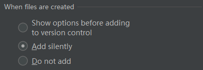

> 当前位置：【Java】13_Tools（工具）-> 13.3_VcsTools（源码管理工具） -> 01_Git和GitLab

# 第一章 Git 简介

- 

# 第二章 Git 安装和配置

Mac 系统默认安装位置：/usr/bin/git


- 查看配置

```bash
git config --list
```

- 查看用户名和邮箱地址

```bash
git config user.name
git config user.email
```

- 修改全局用户名和邮箱地址

```bash
git config --global --replace-all user.name "输入你的用户名"
git config --global --replace-all user.email "输入你的邮箱"
```

- 修改局部用户名和邮箱地址

```bash
cd ~/you project

git config user.name "username"
git config user.email "email"

git config user.name "蓝田_Loto"
git config user.email "shorfng@126.com"
```

# 第三章 Git 使用（命令行方式）

## 1、代码回滚到特定版本

- 步骤1：查找 commitId

```bash
# 查看commit记录
git log

# 找到要回滚的版本的 commitId
```

- 步骤2：将本地文件回滚

```bash
# xxx表示 commitId
git reset --hard xxx
```

- 步骤3：将远程代码库回滚

```bash
# 两个命令任选一个即可
git push origin HEAD --force
git push -f
```


# 第四章 Git 在 idea 中的使用

## 1、Git 在 idea 中的使用

### 1.1 配置 idea 

- 配置1：在文件的行号侧边栏中显示作者（右键 - > Annotate）

- 配置2：创建新文件默认添加到Git（Settings -> VersionControl -> Confirmation -> Add silently）



### 1.2 快捷键

- 查看所有改动之处

```
Mac：Ctrl + Shift + Alt
Win：
```

- 撤销

```
撤销单个改动之处（在要撤销的改动地方使用快捷键）
撤销本文件改动之处（在没有改动地方使用快捷键）

Mac：Alt + Cmd + Z
Win：
```


### 1.3 将SVN项目改成Git项目

- 路径：项目 -> .idea ->vcs.xml

```bash
<mapping directory="" vcs="git" />
```


## 2、GitHub 在 idea 中的使用

- 


## 3、GitLab 在 idea 中的使用

### 3.1 本地项目提交到GitLab - 配置 SSH Keys

- 步骤1：检查是否显示有id_rsa.pub或者id_dsa.pub存在

```bash
# 打开本地git安装目录下的git bash

# 检查是否显示有id_rsa.pub或者id_dsa.pub存在
ls -al ~/.ssh
```

- 步骤2：如果存在，直接id_rsa.pub中的复制内容

- 步骤3：如果不存在，生成 id_rsa.pub

```bash
# 输入命令之后一直按回车就可以了，在命令行中可以看到id_rsa和id_rsa.pub文件和生成的路径
# 邮箱地址替换成GitLab中的邮箱地址（在GitLab中settings -> profile）
ssh-keygen -t rsa -C "your_email@example.com"

ssh-keygen -t rsa -C "shorfng@126.com"
```

- 步骤4：根据路径将 id_rsa.pub 文件中的内容复制到 GitLab 中的 SSH Keys 配置中

- 步骤5：在idea中，打开将要上传的项目

# 第五章 报错

## 1、remote: No anonymous write access

- 解决方案：控制面板 -> 用户帐户 -> 凭据管理器，将关于GitHub的凭证删除掉