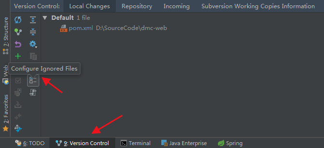

> 当前位置：【Java】13_Tools（工具）-> 13.3_VcsTools（源码管理工具） -> 02_SVN

# 第一章 使用 SVN（Linux 环境）

## 1、创建新项目

```bash
# svn 数据目录：/svn/svndata

# 1、创建仓库的命令
svn_td svnadmin create /svn/svndata/svn_td

# 2、进入到新的项目的conf目录下
cd /svn/svndata/svn_td/conf

# 3、修改 passwd 文件
vi passwd

[users]
# harry = harryssecret
# sally = sallyssecret
要添加的用户名 = 对应的密码 

# 4、修改 authz 文件
vi authz

# 添加项目权限配置，添加到最后
[svn_td:/]
td = rw 

# 5、修改svnserve.conf 文件
vi svnserve.conf

anon-access = none
auth-access = write
password-db = passwd
authz-db = authz 

# 6、停止svn
killall svnserve

# 7、启动svn项目
svnserve -d -r /svn/svndata/

8、测试是否创建成功
svn co svn://47.96.11.3/svn_td

9、创建目录
mkdir trunk
mkdir branches
mkdir tags
```

# 第二章 使用 SVN（Win 环境）

## 1、下载（汉化包在网页下面）

- https://tortoisesvn.net/downloads.html


## 2、安装

- 一路下一步即可（勾选command line client tools）

- 在桌面或任意文件夹右键出现svn命令选项即为安装成功

  

## 3、基本操作

- 初始化项目：版本库浏览器

- 下载项目到本地：检出/SVN checkout


- 提交/commit

- 更新/update

- 回滚：SVN 还原/

# 第三章 使用 SVN（idea 环境）

## 1、创建分支


## 2、合并


## 3、设置忽略文件

### 3.1 方式1

- Version Control - > Configure Ignored Files

 

- 进行增删改操作


### 方式2

- https://blog.csdn.net/sinat_36710456/article/details/82417955


## 4、解决冲突

# 第四章 SVN 报错

- 问题报错：The path to the Subversion executable is probably wrong

  - 原因分析：在安装的TortoiseSVN工具时，没有安装command-line

  - 解决方案：
    - 步骤1：http://subversion.apache.org/packages.html 选择系统对应的VisualSVN，点进去之后下载 Apache Subversion command line tools
    - 步骤2：idea配置


- 参考：https://blog.csdn.net/sinat_37812785/article/details/80243207