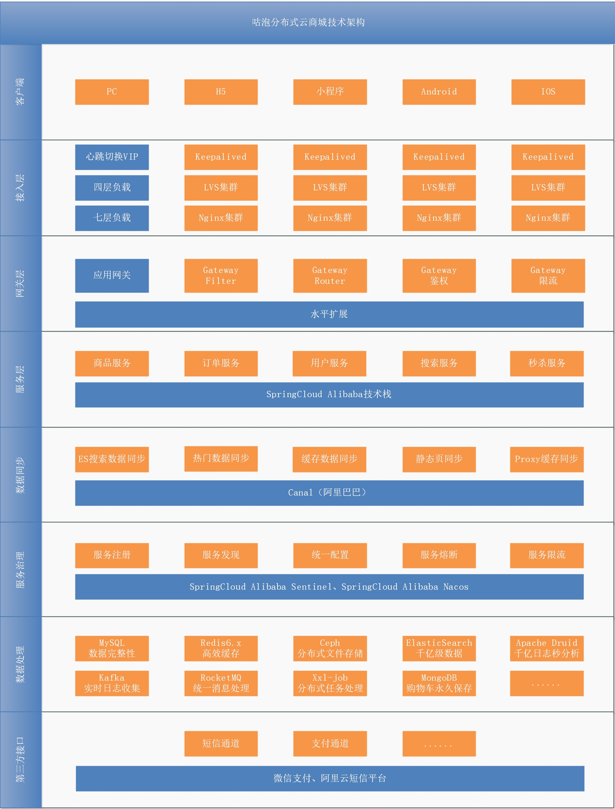
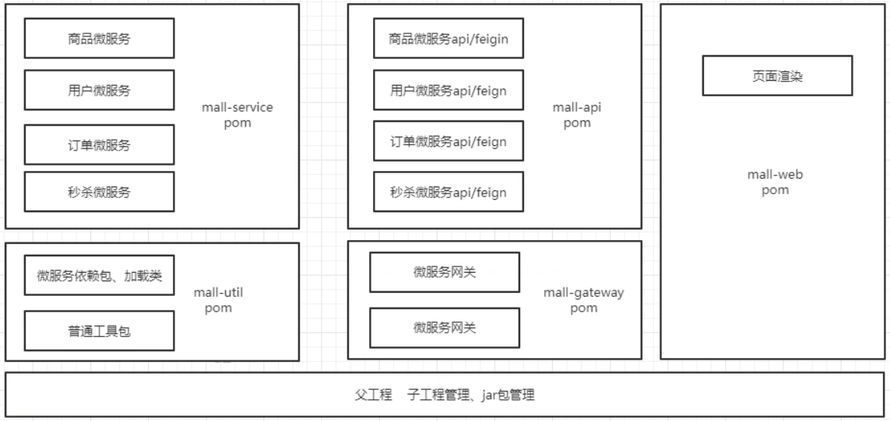
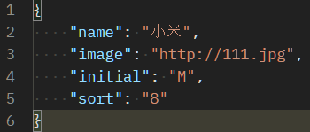
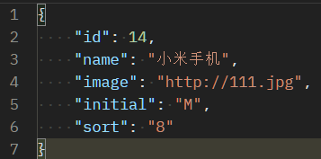
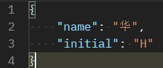

# 电商知识 - 主流电商模式

## （1）B2B（Business to Business）

- 交易双方的身份都是商家，也就是商家将商品卖给商家，类似采购、批发类购物
- 国内代表性网站：阿里巴巴批发网(1688)


## （2）C2C（Customer to Customer）

- 交易双方都可以是个人
- 比如淘宝网


## （3）B2B2C

- 大型的电商平台，允许商家入驻，允许会员在平台买卖商品
- 京东和天猫都属于这类型网站


## （3）O2O（Online To Offline）

- 线上线下模式
- 典型的代表饿了么，在线上支付了，在线下获取商品


# 第一章 架构设计

## 1、整体架构图




## 2、技术选型

|              | 框架/组件 | 使用版本 |
| ------------ | --------- | -------- |
| 容器编排     | Docker    | 20.10.12 |
| 服务注册     | Nacos     | 1.4.2    |
| 服务发现     | Nacos     | 1.4.2    |
| 数据库       | MySQL     | 5.7.34   |
| API 接口文档 | Swagger   | 2.9.2    |
|              |           |          |
|              |           |          |


# 第二章 数据库表设计

## 1、商品数据库 shop_goods

### 品牌表：`brand`

```sql
CREATE TABLE `brand` (
  `id` int(11) NOT NULL AUTO_INCREMENT COMMENT '品牌id',
  `name` varchar(100) NOT NULL COMMENT '品牌名称',
  `image` varchar(1000) DEFAULT '' COMMENT '品牌图片地址',
  `initial` varchar(1) DEFAULT '' COMMENT '品牌的首字母',
  `sort` int(11) DEFAULT NULL COMMENT '排序',
  PRIMARY KEY (`id`)
) ENGINE=InnoDB AUTO_INCREMENT=325475 DEFAULT CHARSET=utf8 COMMENT='品牌表';
```


### 商品分类表：`category`

```sql
CREATE TABLE `category` (
  `id` int(20) NOT NULL AUTO_INCREMENT COMMENT '分类ID',
  `name` varchar(50) DEFAULT NULL COMMENT '分类名称',
  `sort` int(11) DEFAULT NULL COMMENT '排序',
  `parent_id` int(20) DEFAULT NULL COMMENT '上级ID',
  PRIMARY KEY (`id`),
  KEY `parent_id` (`parent_id`)
) ENGINE=InnoDB AUTO_INCREMENT=11177 DEFAULT CHARSET=utf8 COMMENT='商品类目';
```


### 品牌分类关联表：`category_brand`

```sql
CREATE TABLE `category_brand` (
  `category_id` int(11) NOT NULL COMMENT '分类ID',
  `brand_id` int(11) NOT NULL COMMENT '品牌ID',
  PRIMARY KEY (`brand_id`,`category_id`)
) ENGINE=InnoDB DEFAULT CHARSET=utf8;
```


### 商品属性表：`sku_attribute`

```sql
CREATE TABLE `sku_attribute` (
  `id` int(11) NOT NULL AUTO_INCREMENT COMMENT 'ID',
  `name` varchar(50) DEFAULT NULL COMMENT '属性名称',
  `options` varchar(2000) DEFAULT NULL COMMENT '属性选项',
  `sort` int(11) DEFAULT NULL COMMENT '排序',
  `category_id` varchar(100) DEFAULT NULL COMMENT '分类ID集合',
  PRIMARY KEY (`id`)
) ENGINE=InnoDB AUTO_INCREMENT=140 DEFAULT CHARSET=utf8;
```


### 商品SPU表：`spu`

```sql
CREATE TABLE `spu` (
  `id` varchar(60) NOT NULL COMMENT '主键',
  `name` varchar(100) DEFAULT NULL COMMENT 'SPU名',
  `intro` varchar(200) DEFAULT NULL COMMENT '商品简介',
  `brand_id` int(11) DEFAULT NULL COMMENT '品牌ID',
  `category_one_id` int(20) DEFAULT NULL COMMENT '一级分类',
  `category_two_id` int(10) DEFAULT NULL COMMENT '二级分类',
  `category_three_id` int(10) DEFAULT NULL COMMENT '三级分类',
  `images` varchar(1000) DEFAULT NULL COMMENT '图片列表',
  `after_sales_service` varchar(50) DEFAULT NULL COMMENT '售后服务',
  `content` longtext COMMENT '介绍',
  `attribute_list` varchar(3000) DEFAULT NULL COMMENT '规格列表',
  `is_marketable` int(1) DEFAULT '0' COMMENT '是否上架,0已下架，1已上架',
  `is_delete` int(1) DEFAULT '0' COMMENT '是否删除,0:未删除，1：已删除',
  `status` int(1) DEFAULT '0' COMMENT '审核状态，0：未审核，1：已审核，2：审核不通过',
  PRIMARY KEY (`id`)
) ENGINE=InnoDB DEFAULT CHARSET=utf8;
```


### 商品SKU表：`sku`

```sql
CREATE TABLE `sku` (
  `id` varchar(60) NOT NULL COMMENT '商品id',
  `name` varchar(200) NOT NULL COMMENT 'SKU名称',
  `price` int(20) NOT NULL DEFAULT '1' COMMENT '价格（分）',
  `num` int(10) DEFAULT '100' COMMENT '库存数量',
  `image` varchar(200) DEFAULT NULL COMMENT '商品图片',
  `images` varchar(2000) DEFAULT NULL COMMENT '商品图片列表',
  `create_time` datetime DEFAULT NULL COMMENT '创建时间',
  `update_time` datetime DEFAULT NULL COMMENT '更新时间',
  `spu_id` varchar(60) DEFAULT NULL COMMENT 'SPUID',
  `category_id` int(10) DEFAULT NULL COMMENT '类目ID',
  `category_name` varchar(200) DEFAULT NULL COMMENT '类目名称',
  `brand_name` varchar(100) DEFAULT NULL COMMENT '品牌名称',
  `sku_attribute` varchar(200) DEFAULT NULL COMMENT '规格',
  `status` int(1) DEFAULT '1' COMMENT '商品状态 1-正常，2-下架，3-删除',
  PRIMARY KEY (`id`),
  KEY `cid` (`category_id`),
  KEY `status` (`status`),
  KEY `updated` (`update_time`)
) ENGINE=InnoDB DEFAULT CHARSET=utf8 COMMENT='商品表';
```


## 2、订单数据库

### 订单表：`order`

```sql
CREATE TABLE `order` (
  `id` varchar(50) COLLATE utf8_bin NOT NULL COMMENT '订单id',
  `total_num` int(11) DEFAULT NULL COMMENT '数量合计',
  `moneys` int(11) DEFAULT NULL COMMENT '金额合计',
  `pay_type` varchar(1) COLLATE utf8_bin DEFAULT NULL COMMENT '支付类型，1、在线支付、0 货到付款',
  `create_time` datetime DEFAULT NULL COMMENT '订单创建时间',
  `update_time` datetime DEFAULT NULL COMMENT '订单更新时间',
  `pay_time` datetime DEFAULT NULL COMMENT '付款时间',
  `consign_time` datetime DEFAULT NULL COMMENT '发货时间',
  `end_time` datetime DEFAULT NULL COMMENT '交易完成时间',
  `username` varchar(50) COLLATE utf8_bin DEFAULT NULL COMMENT '用户名称',
  `recipients` varchar(50) COLLATE utf8_bin DEFAULT NULL COMMENT '收货人',
  `recipients_mobile` varchar(12) COLLATE utf8_bin DEFAULT NULL COMMENT '收货人手机',
  `recipients_address` varchar(200) COLLATE utf8_bin DEFAULT NULL COMMENT '收货人地址',
  `weixin_transaction_id` varchar(30) COLLATE utf8_bin DEFAULT NULL COMMENT '交易流水号',
  `order_status` int(1) COLLATE utf8_bin DEFAULT NULL COMMENT '订单状态,0:未完成,1:已完成，2：已退货',
  `pay_status` int(1) COLLATE utf8_bin DEFAULT NULL COMMENT '支付状态,0:未支付，1：已支付，2：支付失败',
  `is_delete` int(1) COLLATE utf8_bin DEFAULT NULL COMMENT '是否删除',
  PRIMARY KEY (`id`),
  KEY `create_time` (`create_time`),
  KEY `status` (`order_status`),
  KEY `payment_type` (`pay_type`)
) ENGINE=InnoDB DEFAULT CHARSET=utf8 COLLATE=utf8_bin;
```


### 订单明细表：`order_sku`

```sql
CREATE TABLE `order_sku` (
  `id` varchar(50) COLLATE utf8_bin NOT NULL COMMENT 'ID',
  `category_one_id` int(11) DEFAULT NULL COMMENT '1级分类',
  `category_two_id` int(11) DEFAULT NULL COMMENT '2级分类',
  `category_three_id` int(11) DEFAULT NULL COMMENT '3级分类',
  `spu_id` varchar(60) COLLATE utf8_bin DEFAULT NULL COMMENT 'SPU_ID',
  `sku_id` varchar(60) COLLATE utf8_bin DEFAULT NULL COMMENT 'SKU_ID',
  `order_id` varchar(50) COLLATE utf8_bin NOT NULL COMMENT '订单ID',
  `name` varchar(200) COLLATE utf8_bin DEFAULT NULL COMMENT '商品名称',
  `price` int(20) DEFAULT NULL COMMENT '单价',
  `num` int(10) DEFAULT NULL COMMENT '数量',
  `money` int(20) DEFAULT NULL COMMENT '总金额',
  `image` varchar(200) COLLATE utf8_bin DEFAULT NULL COMMENT '图片地址',
  PRIMARY KEY (`id`),
  KEY `item_id` (`sku_id`),
  KEY `order_id` (`order_id`)
) ENGINE=InnoDB DEFAULT CHARSET=utf8 COLLATE=utf8_bin;
```


## 3、秒杀数据库

### 秒杀商品表：`seckill_goods`

```sql
CREATE TABLE `seckill_goods` (
  `id` varchar(60) NOT NULL,
  `sup_id` varchar(60) DEFAULT NULL COMMENT 'spu ID',
  `sku_id` varchar(60) DEFAULT NULL COMMENT 'sku ID',
  `name` varchar(100) DEFAULT NULL COMMENT '标题',
  `images` varchar(150) DEFAULT NULL COMMENT '商品图片',
  `price` int(20) DEFAULT NULL COMMENT '原价格',
  `seckill_price` double(20,0) DEFAULT NULL COMMENT '秒杀价格',
  `create_time` datetime DEFAULT NULL COMMENT '添加日期',
  `start_time` datetime DEFAULT NULL COMMENT '开始时间',
  `end_time` datetime DEFAULT NULL COMMENT '结束时间',
  `num` int(11) DEFAULT NULL COMMENT '秒杀商品数',
  `store_count` int(11) DEFAULT NULL COMMENT '剩余库存数',
  `content` varchar(2000) DEFAULT NULL COMMENT '描述',
  PRIMARY KEY (`id`)
) ENGINE=InnoDB DEFAULT CHARSET=utf8;
```


### 秒杀订单表：`seckill_order`

```sql
CREATE TABLE `seckill_order` (
  `id` varchar(60) NOT NULL COMMENT '主键',
  `seckill_goods_id` varchar(60) DEFAULT NULL COMMENT '秒杀商品ID',
  `money` int(10) DEFAULT NULL COMMENT '支付金额',
  `username` varchar(50) DEFAULT NULL COMMENT '用户',
  `create_time` datetime DEFAULT NULL COMMENT '创建时间',
  `pay_time` datetime DEFAULT NULL COMMENT '支付时间',
  `status` int(1) DEFAULT NULL COMMENT '状态，0未支付，1已支付',
  `weixin_transaction_id` varchar(30) DEFAULT NULL COMMENT '交易流水',
  PRIMARY KEY (`id`)
) ENGINE=InnoDB DEFAULT CHARSET=utf8;
```


## 4、用户数据库

### 省份表：`provinces`

```sql
CREATE TABLE `provinces` (
  `provinceid` varchar(20) NOT NULL COMMENT '省份ID',
  `province` varchar(50) NOT NULL COMMENT '省份名称',
  PRIMARY KEY (`provinceid`)
) ENGINE=InnoDB DEFAULT CHARSET=utf8 COMMENT='省份信息表';
```


### 城市表：`cities`

```sql
CREATE TABLE `cities` (
  `cityid` varchar(20) NOT NULL COMMENT '城市ID',
  `city` varchar(50) NOT NULL COMMENT '城市名称',
  `provinceid` varchar(20) NOT NULL COMMENT '省份ID',
  PRIMARY KEY (`cityid`)
) ENGINE=InnoDB DEFAULT CHARSET=utf8 COMMENT='行政区域地州市信息表';
```


### 区域表：`areas`

```sql
CREATE TABLE `areas` (
  `areaid` varchar(20) NOT NULL COMMENT '区域ID',
  `area` varchar(50) NOT NULL COMMENT '区域名称',
  `cityid` varchar(20) NOT NULL COMMENT '城市ID',
  PRIMARY KEY (`areaid`)
) ENGINE=InnoDB DEFAULT CHARSET=utf8 COMMENT='行政区域县区信息表';
```


### 收件信息表：`address`

```sql
CREATE TABLE `address` (
  `id` int(11) NOT NULL AUTO_INCREMENT,
  `username` varchar(50) DEFAULT NULL COMMENT '用户名',
  `provinceid` varchar(20) DEFAULT NULL COMMENT '省',
  `cityid` varchar(20) DEFAULT NULL COMMENT '市',
  `areaid` varchar(20) DEFAULT NULL COMMENT '县/区',
  `phone` varchar(20) DEFAULT NULL COMMENT '电话',
  `address` varchar(200) DEFAULT NULL COMMENT '详细地址',
  `contact` varchar(50) DEFAULT NULL COMMENT '联系人',
  `is_default` int(1) DEFAULT NULL COMMENT '是否是默认 1默认 0否',
  PRIMARY KEY (`id`)
) ENGINE=InnoDB AUTO_INCREMENT=66 DEFAULT CHARSET=utf8;
```


# 第三章 项目结构

- mall-api：存储所有数据库表对应的Bean和Feign接口
- mall-gateway：存储所有微服务网关
- mall-service：存储所有微服务工程
  - mall-common：工具工程
  - mall-service-dependency：所有微服务工程公共依赖包、所有微服务工程公共配置类
- mall-util：存储公共工程
- mall-web：存储所有和页面渲染有关的工程




# 第四章 功能开发 - 品牌管理

## 1、表结构

- 品牌表：`brand`

```sql
CREATE TABLE `brand` (
  `id` int(11) NOT NULL AUTO_INCREMENT COMMENT '品牌id',
  `name` varchar(100) NOT NULL COMMENT '品牌名称',
  `image` varchar(1000) DEFAULT '' COMMENT '品牌图片地址',
  `initial` varchar(1) DEFAULT '' COMMENT '品牌的首字母',
  `sort` int(11) DEFAULT NULL COMMENT '排序',
  PRIMARY KEY (`id`)
) ENGINE=InnoDB AUTO_INCREMENT=325475 DEFAULT CHARSET=utf8 COMMENT='品牌表';
```


## 2、MybatisPlus 集成

- 在 `mall-service-dependency` 中引入依赖

```xml
<!-- MyBatis Plus -->
<dependency>
    <groupId>com.baomidou</groupId>
    <artifactId>mybatis-plus-boot-starter</artifactId>
    <version>3.4.3.4</version>
</dependency>
```

- 在 `mall-api `中引入依赖（编写JavaBean会用到MyBatis Plus的相关注解，引入依赖防止程序编译不通过）

```xml
<!-- MyBatis Plus -->
<dependency>
    <groupId>com.baomidou</groupId>
    <artifactId>mybatis-plus-boot-starter</artifactId>
    <version>3.4.3.4</version>
    <scope>provided</scope>
</dependency>
```


## 3、创建 mall-api-goods 工程

- 用于创建 `shop_goods` 数据库表对应的实体Bean和Feign接口


## 4、创建 mall-service-goods 商品微服务


## 5、代码开发 - 增删改查

|               | 参数                                                         | 访问地址                           |
| ------------- | ------------------------------------------------------------ | ---------------------------------- |
| 增 post       |  | http://localhost:8081/brand        |
| 改 put        |  | http://localhost:8081/brand        |
| 删 delete     |                                                              | http://localhost:8081/brand/14     |
| 查 - 条件查询 |  | http://localhost:8081/brand/search |
| 查 - 分页查询 |                                                              |                                    |

