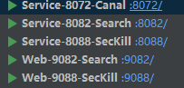

> 当前位置：【Java】项目-云商城

# 电商知识 - 主流电商模式

## （1）B2B（Business to Business）

- 交易双方的身份都是商家，也就是商家将商品卖给商家，类似采购、批发类购物
- 国内代表性网站：阿里巴巴批发网(1688)


## （2）C2C（Customer to Customer）

- 交易双方都可以是个人
- 比如淘宝网


## （3）B2B2C

- 大型的电商平台，允许商家入驻，允许会员在平台买卖商品
- 京东和天猫都属于这类型网站


## （3）O2O（Online To Offline）

- 线上线下模式
- 典型的代表饿了么，在线上支付了，在线下获取商品


# 第一章 架构设计

## 1、整体架构图


## 2、技术选型

|              | 框架/组件 | 使用版本 |
| ------------ | --------- | -------- |
| 容器编排     | Docker    | 20.10.12 |
| 服务注册     | Nacos     | 1.4.2    |
| 服务发现     | Nacos     | 1.4.2    |
| 数据库       | MySQL     | 5.7.34   |
| API 接口文档 | Swagger   | 2.9.2    |
|              |           |          |
|              |           |          |

# 第二章 数据库表设计


# 第三章 项目结构

- mall-api：存储所有数据库表对应的Bean和Feign接口
- mall-gateway：存储所有微服务网关
- mall-service：存储所有微服务工程
  - mall-service-goods：品牌管理，8081
  - mall-service-cephfile：文件服务器，8082

- mall-util：存储公共工程
  - mall-common：工具工程
  - mall-service-dependency：所有微服务工程公共依赖包、所有微服务工程公共配置类

- mall-web：存储所有和页面渲染有关的工程


# 第四章 静态页发布 OpenResty

## 步骤1：上传静态文件

```bash
# 上传路径
/usr/local/TDStaticProject/MyProject_mall/frant/
```

## 步骤2：修改 nginx.conf

```bash
vi /usr/local/openresty/nginx/conf/nginx.conf

# MyProject_mall 门户发布
server {
    listen       80;
    server_name  www.mymall.com;

    location / {
    	root   /usr/local/TDStaticProject/MyProject_mall/frant;
    }
}

# 重新加载 Nginx
nginx -s reload
```

## 步骤3：修改 host

```bash
C:\Windows\System32\drivers\etc\HOSTS

# MyProject_mall 门户发布
192.168.126.134 www.mymall.com
```

## 步骤4：访问

- http://www.mymall.com/

# 第五章 功能开发 - 品牌管理

## 1、表结构

- 品牌表：`brand`

```sql
CREATE TABLE `brand` (
  `id` int(11) NOT NULL AUTO_INCREMENT COMMENT '品牌id',
  `name` varchar(100) NOT NULL COMMENT '品牌名称',
  `image` varchar(1000) DEFAULT '' COMMENT '品牌图片地址',
  `initial` varchar(1) DEFAULT '' COMMENT '品牌的首字母',
  `sort` int(11) DEFAULT NULL COMMENT '排序',
  PRIMARY KEY (`id`)
) ENGINE=InnoDB AUTO_INCREMENT=325475 DEFAULT CHARSET=utf8 COMMENT='品牌表';
```


## 2、MybatisPlus 集成

- 在 `mall-service-dependency` 中引入依赖

```xml
<!-- MyBatis Plus -->
<dependency>
    <groupId>com.baomidou</groupId>
    <artifactId>mybatis-plus-boot-starter</artifactId>
    <version>3.4.3.4</version>
</dependency>
```

- 在 `mall-api `中引入依赖（编写JavaBean会用到MyBatis Plus的相关注解，引入依赖防止程序编译不通过）

```xml
<!-- MyBatis Plus -->
<dependency>
    <groupId>com.baomidou</groupId>
    <artifactId>mybatis-plus-boot-starter</artifactId>
    <version>3.4.3.4</version>
    <scope>provided</scope>
</dependency>
```


## 3、创建 mall-api-goods 工程

- 用于创建 `shop_goods` 数据库表对应的实体Bean和Feign接口


## 4、创建 mall-service-8081-goods（商品微服务）


## 5、代码开发 - 增删改查

|               | 访问地址                               | 参数                                                         |
| ------------- | -------------------------------------- | ------------------------------------------------------------ |
| 增 post       | http://localhost:8081/brand            |  |
| 改 put        | http://localhost:8081/brand            |  |
| 删 delete     | http://localhost:8081/brand/14         |                                                              |
| 查 - 条件查询 | http://localhost:8081/brand/search     |  |
| 查 - 分页查询 | http://localhost:8081/brand/search/1/2 |  |

# 第六章 功能开发 - 产品发布

## 1、表结构

### spu：同类产品信息

```sql
DROP TABLE IF EXISTS `spu`;
CREATE TABLE `spu`
(
    `id`                  varchar(60) NOT NULL COMMENT '主键',
    `name`                varchar(100)  DEFAULT NULL COMMENT 'SPU名',
    `intro`               varchar(200)  DEFAULT NULL COMMENT '简介',
    `brand_id`            int(11)       DEFAULT NULL COMMENT '品牌ID',
    `category_one_id`     int(20)       DEFAULT NULL COMMENT '一级分类',
    `category_two_id`     int(10)       DEFAULT NULL COMMENT '二级分类',
    `category_three_id`   int(10)       DEFAULT NULL COMMENT '三级分类',
    `images`              varchar(1000) DEFAULT NULL COMMENT '图片列表',
    `after_sales_service` varchar(50)   DEFAULT NULL COMMENT '售后服务',
    `content`             longtext COMMENT '介绍',
    `attribute_list`      varchar(3000) DEFAULT NULL COMMENT '规格列表',
    `is_marketable`       int(1)        DEFAULT '0' COMMENT '是否上架,0已下架，1已上架',
    `is_delete`           int(1)        DEFAULT '0' COMMENT '是否删除,0:未删除，1：已删除',
    `status`              int(1)        DEFAULT '0' COMMENT '审核状态，0：未审核，1：已审核，2：审核不通过',
    PRIMARY KEY (`id`)
) ENGINE = InnoDB
  DEFAULT CHARSET = utf8 COMMENT ='商品表（同类产品信息）';
```

### sku：商品表（每个产品信息）

```sql
CREATE TABLE `sku`
(
    `id`            varchar(60)  NOT NULL COMMENT '商品id',
    `name`          varchar(200) NOT NULL COMMENT 'SKU名称',
    `price`         int(20)      NOT NULL DEFAULT '1' COMMENT '价格（分）',
    `num`           int(10)               DEFAULT '100' COMMENT '库存数量',
    `image`         varchar(200)          DEFAULT NULL COMMENT '商品图片',
    `images`        varchar(2000)         DEFAULT NULL COMMENT '商品图片列表',
    `create_time`   datetime              DEFAULT NULL COMMENT '创建时间',
    `update_time`   datetime              DEFAULT NULL COMMENT '更新时间',
    `spu_id`        varchar(60)           DEFAULT NULL COMMENT 'SPUID',
    `category_id`   int(10)               DEFAULT NULL COMMENT '类目ID',
    `category_name` varchar(200)          DEFAULT NULL COMMENT '类目名称',
    `brand_id`      int(11)               DEFAULT NULL COMMENT '品牌id',
    `brand_name`    varchar(100)          DEFAULT NULL COMMENT '品牌名称',
    `sku_attribute` varchar(200)          DEFAULT NULL COMMENT '规格',
    `status`        int(1)                DEFAULT '1' COMMENT '商品状态 1-正常，2-下架，3-删除',
    PRIMARY KEY (`id`),
    KEY `cid` (`category_id`),
    KEY `status` (`status`),
    KEY `updated` (`update_time`)
) ENGINE = InnoDB
  DEFAULT CHARSET = utf8 COMMENT ='商品表（每个产品信息）';
```

### category：商品类目

```sql
DROP TABLE IF EXISTS `category`;
CREATE TABLE `category`
(
    `id`        int(20) NOT NULL AUTO_INCREMENT COMMENT '分类ID',
    `name`      varchar(50) DEFAULT NULL COMMENT '分类名称',
    `sort`      int(11)     DEFAULT NULL COMMENT '排序',
    `parent_id` int(20)     DEFAULT NULL COMMENT '上级ID',
    PRIMARY KEY (`id`),
    KEY `parent_id` (`parent_id`)
) ENGINE = InnoDB
  DEFAULT CHARSET = utf8 COMMENT ='商品类目';
```

### category_brand：分类品牌关系表

```sql
DROP TABLE IF EXISTS `category_brand`;
CREATE TABLE `category_brand`
(
    `category_id` int(11) NOT NULL COMMENT '分类ID',
    `brand_id`    int(11) NOT NULL COMMENT '品牌ID',
    PRIMARY KEY (`brand_id`, `category_id`)
) ENGINE = InnoDB
  DEFAULT CHARSET = utf8 COMMENT ='分类品牌关系表';
```

### brand：品牌表

```sql
DROP TABLE IF EXISTS `brand`;
CREATE TABLE `brand`
(
    `id`      int(11)      NOT NULL AUTO_INCREMENT COMMENT '品牌id',
    `name`    varchar(100) NOT NULL COMMENT '品牌名称',
    `image`   varchar(1000) DEFAULT '' COMMENT '品牌图片地址',
    `initial` varchar(1)    DEFAULT '' COMMENT '品牌的首字母',
    `sort`    int(11)       DEFAULT NULL COMMENT '排序',
    PRIMARY KEY (`id`)
) ENGINE = InnoDB
  DEFAULT CHARSET = utf8 COMMENT ='品牌表';
```

### category_attr：分类属性表

```sql
DROP TABLE IF EXISTS `category_attr`;
CREATE TABLE `category_attr`
(
    `category_id` int(11) NOT NULL COMMENT '分类id',
    `attr_id`     int(11) NOT NULL COMMENT '属性id',
    PRIMARY KEY (`category_id`, `attr_id`)
) ENGINE = InnoDB
  DEFAULT CHARSET = utf8 COMMENT ='分类属性表';
```

### sku_attribute：属性表

```sql
DROP TABLE IF EXISTS `sku_attribute`;
CREATE TABLE `sku_attribute`
(
    `id`      int(11) NOT NULL AUTO_INCREMENT COMMENT 'ID',
    `name`    varchar(50)   DEFAULT NULL COMMENT '属性名称',
    `options` varchar(2000) DEFAULT NULL COMMENT '属性选项',
    `sort`    int(11)       DEFAULT NULL COMMENT '排序',
    PRIMARY KEY (`id`)
) ENGINE = InnoDB
  DEFAULT CHARSET = utf8 COMMENT ='属性表';
```


## 2、搭建 mall-service-8071-cephfile（文件上传微服务）

- 选择 Ceph，通过网关可以适配兼容 swift api， 同时在数据访问上具有较强的扩展性

- 测试

|               | 访问地址                                          | 参数                                                         |
| ------------- | ------------------------------------------------- | ------------------------------------------------------------ |
| 文件上传 post | http://localhost:8082/file/upload                 |  |
| 文件预览 get  | http://localhost:8082/file/download/双人成行.jpeg |                                                              |


## 3、SPU 和 SKU

### 3.1 SPU（Standard Product Unit，标准化产品单元）

- SPU是商品信息聚合的最小单位，是一组可复用、易检索的标准化信息的集合，该集合描述了一个产品的特性
- 通俗点讲，==属性值、特性相同==的商品就可以称为一个SPU

### 3.2 SKU（Stock Keeping Unit，库存量单位）

- SKU即库存进出计量的单位， 可以是以件、盒、托盘等为单位。
- SKU是物理上不可分割的最小存货单元。
- 在使用时要根据不同业态，不同管理模式来处理。
- 在服装、鞋类商品中使用最多最普遍。
- 通俗点讲，==属性值、特性不相同==的商品就可以称为一个SKU


## 4、代码开发

|                                            | 访问地址                                          | 参数 |
| ------------------------------------------ | ------------------------------------------------- | ---- |
| 【get】查询所有子类（根据分类的 parentId） | http://localhost:8081/category/parent/0           |      |
| 【get】查询品牌信息（根据分类ID）          | http://localhost:8081/brand/category/11159        |      |
| 【get】查询属性集合（根据分类ID）          | http://localhost:8081/skuAttribute/category/11159 |      |
| 【post】保存/修改同类产品信息 spu          | http://localhost:8081/spu/save/                   |      |

# 第七章  功能开发 - 商品推广

## 1、表结构

```sql
DROP TABLE IF EXISTS `ad_items`;
CREATE TABLE `ad_items`
(
    `id`     int(11) NOT NULL AUTO_INCREMENT,
    `name`   varchar(100) DEFAULT NULL,
    `type`   int(3)       DEFAULT NULL COMMENT '分类，1首页推广,2列表页推广',
    `sku_id` varchar(60)  DEFAULT NULL COMMENT '展示的产品（对应Sku）',
    `sort`   int(11)      DEFAULT NULL COMMENT '排序',
    PRIMARY KEY (`id`)
) ENGINE = InnoDB
  DEFAULT CHARSET = utf8 COMMENT ='商品推广表';
```

## 2、Redis 缓存常用注解

```java
// 开关性注解，在项目启动类或某个配置类上使用此注解后，则表示允许使用注解的方式进行缓存操作。
// 开启缓存注解，启动类上用
@EnableCaching

// 可用于类或方法上；在目标方法执行前，会根据key先去缓存中查询看是否有数据，有就直接返回缓存中的key对应的value值。不再执行目标方法；无则执行目标方法，并将方法的返回值作为value，并以键值对的形式存入缓存。
// 新增缓存时用（第一次会把数据缓存，后面会先查缓存中有没有，有的话就直接用，没有再查库）
@Cacheable

// 可用于类或方法上；在执行完目标方法后，清除缓存中对应key的数据(如果缓存中有对应key的数据缓存的话)
// @CacheEvict(key = "#typeId")  // 删除缓存时用
@CacheEvict

// 可用于类或方法上；在执行完目标方法后，并将方法的返回值作为value，并以键值对的形式存入缓存中
// @CachePut(key = "#typeId")  // 修改缓存时用（每次都把数据存到缓存，但不会使用缓存的数据）
@CachePut

// 此注解即可作为@Cacheable、@CacheEvict、@CachePut三种注解中的的任何一种或几种来使用
// 一般不用
@Caching

// 可以用于配置@Cacheable、@CacheEvict、@CachePut这三个注解的一些公共属性，例如cacheNames、keyGenerator
// @CacheConfig(cacheNames = "ad-items-skus")  // 开启缓存（cacheNames 为缓存的key ）
@CacheConfig
```

## 3、多级缓存（Lua + Redis）


- 第一次请求通过 Nginx 的时候，先使用 Lua 脚本查询Redis
- 如果 Redis 有缓存数据，则将数据存入到 Nginx 缓存，再将数据响应给用户（使用 Lua 脚本将数据从 Redis中加载出来）
- 如果 Redis 没有缓存数据，则加载 Nginx 缓存
- 如果 Nginx 没有缓存数据，则将请求路由到 Tomcat，Tomcat 发布的程序会去查库，查库后需要做缓存的，将数据存入 Redis 缓存，再响应数据给用户
- 第二次请求通过 Nginx 的时候，先查 Nginx 缓存，没有，再查 Redis 缓存，还没有，最后才会通过 Tomcat 查库

### 步骤1：创建 aditem.lua

```bash
# 存放位置
/usr/local/openresty/nginx/lua/aditem.lua
```

- aditem.lua

```lua
-- 数据响应类型JSON
ngx.header.content_type = "application/json;charset=utf8"

-- Redis库依赖
local redis = require("resty.redis");
local cjson = require("cjson");

-- 获取typeId参数（type）
local typeId = ngx.req.get_uri_args()["typeId"];

-- key组装
local key = "ad-items-skus::" .. typeId

-- 创建链接对象
local red = redis:new()

-- 设置超时时间
red:set_timeout(2000)

-- 设置服务器链接信息
red:connect("xxxxx", 6379)
red:auth("xxxxxx")

-- 查询指定key的数据
local result = red:get(key);

-- 关闭Redis链接
red:close()

if result == nil or result == null or result == ngx.null then
    return true
else
    --输出数据
    ngx.say(result)
end
```

### 步骤2：修改 nginx.conf

```bash
# 文件位置
/usr/local/openresty/nginx/conf/nginx.conf
```

- nginx.conf

```properties
# MyProject_mall 
server {
    listen       80;
    # 门户网站
    server_name  www.mymall.com;

    # 推广产品查询
    location /sku/aditems/type {
		content_by_lua_file /usr/local/openresty/nginx/lua/aditem.lua;
    }

    # 门户静态页
    location / {
		root   /usr/local/TDStaticProject/MyProject_mall/frant;
    }
}
```

### 步骤3：刷新 Nginx 配置

```bash
nginx -s reload
```

### 步骤4：访问

- http://192.168.126.134/sku/aditems/type?typeId=1
- Redis 有缓存，本地项目停止，直接访问，有数据
- Redis 清空缓存，本地项目停止，直接访问，空数据


## 4、Nginx 代理缓存（Proxy_Cache）

### 步骤1：定义缓存空间（开启 Proxy_Cache 缓存空间）

- 修改 /usr/local/openresty/nginx/conf/nginx.conf

```nginx
http {
    include       mime.types;
    default_type  application/octet-stream;
    sendfile        on;
    keepalive_timeout  65;
    
    # 定义缓存空间（开启 Proxy_Cache 缓存空间）
    proxy_cache_path /usr/local/openresty/nginx/cache levels=1:2 keys_zone=openresty_cache:10m max_size=1g inactive=60m use_temp_path=off;
    
    ....
}
```

- 参数说明

```properties
# 指定缓存存储的路径，缓存存储在 /usr/local/openresty/nginx/cache 目录
proxy_cache_path

# 1:2 表示设置一个两级目录层次结构存储缓存，在单个目录中包含大量文件会降低文件访问速度，因此建议对大多数部署使用两级目录层次结构。
# 如果 levels 未包含该参数，Nginx 会将所有文件放在同一目录中。
levels=1:2

# 自定义的缓存名字：openresty_cache
# 缓存的 key 大小：10M
# 设置共享内存区域，用于存储缓存键和元数据，例如使用计时器。拥有内存中的密钥副本，Nginx 可以快速确定请求是否是一个 HIT 或 MISS 不必转到磁盘，从而大大加快了检查速度。1 MB 区域可以存储大约 8,000 个密钥的数据，因此示例中配置的 10 MB 区域可以存储大约 80,000 个密钥的数据
keys_zone=openresty_cache:10m

# 设置缓存大小的上限
# 它是可选的; 不指定值允许缓存增长以使用所有可用磁盘空间。
# 当缓存大小达到限制时，一个称为缓存管理器的进程将删除最近最少使用的缓存，将大小恢复到限制之下的文件
max_size=1g

# 缓存时间：60min
# 指定项目在未被访问的情况下可以保留在缓存中的时间长度。
# 在此示例中，缓存管理器进程会自动从缓存中删除 60 分钟未请求的文件，无论其是否已过期。默认值为 10 分钟（10m）。非活动内容与过期内容不同。Nginx 不会自动删除缓存 header 定义为已过期内容（例如 Cache-Control:max-age=120）。过期（陈旧）内容仅在指定时间内未被访问时被删除。访问过期内容时，Nginx 会从原始服务器刷新它并重置 inactive 计时器
inactive=60m

# 表示 Nginx 会将临时文件保存在缓存数据的同一目录中。这是为了避免在更新缓存时，磁盘之间互相复制响应数据，一般关闭该功能
use_temp_path=off:
```

### 步骤2：在指定地方使用定义的缓存

- 修改 /usr/local/openresty/nginx/conf/nginx.conf

```nginx
# MyProject_mall 
server {
    listen       80;
    # 门户网站
    server_name  www.mymall.com;

    # 推广产品查询
    location /sku/aditems/type {
        # 查找 Redis 缓存
        #content_by_lua_file /usr/local/openresty/nginx/lua/aditem.lua;

        # 查找 Nginx 缓存
        rewrite_by_lua_file /usr/local/openresty/nginx/lua/aditem.lua;

        # 启用缓存 openresty_cache
        proxy_cache openresty_cache;

        # 针对指定请求缓存（如下设置，表示只对 get 请求做缓存）
        #proxy_cache_methods GET;

        # 设置指定响应会缓存（如下设置，表示当响应为200、304时做缓存，缓存时间为 60s）
        proxy_cache_valid 200 304 60s;

        # 最少请求1次才会缓存
        proxy_cache_min_uses 1;

        # 如果并发请求，只有第1个请求会去服务器获取数据，其他请求会从缓存拿
        #proxy_cache_lock on;

        # 缓存文件的唯一key，可以根据它实现对缓存文件的清理操作
        proxy_cache_key $host$uri$is_args$args;

        # 动态代理，查询后端服务
        proxy_pass http://192.168.31.197:8081;
    }

    # 门户静态页
    location / {
        root   /usr/local/TDStaticProject/MyProject_mall/frant;
    }
    ......
}
```

- Proxy_Cache属性

```properties
# 设置是否开启对后端响应的缓存，如果开启的话，参数值就是zone的名称，比如:proxy_cache
proxy_cache

# 针对不同的response code设定不同的缓存时间，如果不设置code，默认为200,301,302,也可以用any指定所有code
proxy_cache_valid

# 指定在多少次请求之后才缓存响应内容,这里表示将缓存内容写入到磁盘
proxy_cache_min_uses

# 默认不开启，开启的话则每次只能有一个请求更新相同的缓存，其他请求要么等待缓存有数据要么限时等待锁释放;nginx 1.1.12才开始有。
# 配套 proxy_cache_lock_timeout 一起使用
proxy_cache_lock

# 缓存文件的唯一key，可以根据它实现对缓存文件的清理操作
proxy_cache_key
```

### 步骤3：重启 Nginx 或重新加载配置文件

```properties
# 重新加载配置文件
nginx -s reload
```

### 步骤4：Nginx 缓存查找规律

- 先查找 Redis 缓存
- Redis 缓存没数据，直接找 Nginx 缓存
- Nginx 缓存没数据，则找真实服务器

### 步骤5：Nginx 缓存，存放位置

```bash
# 缓存存放路径
cd /usr/local/openresty/nginx/cache/6/95/

# 查看 Nginx 缓存
cat 69aedf5372d261e696bdfde044559956
```

- 69aedf5372d261e696bdfde044559956 内容

```json
KEY: 192.168.126.134/sku/aditems/type?typeId=1
HTTP/1.1 200
Content-Type: application/json
Date: Thu, 16 Jun 2022 14:48:18 GMT
Connection: close

[{"id":"1318596430360813570","name":"华为Mate40 Pro 32G 1800万像素","price":112,"num":1227,"image":"https://sklll.oss-cn-beijing.aliyuncs.com/secby/9247d041-e940-426c-8e50-06084b631063.jpg","images":"https://sklll.oss-cn-beijing.aliyuncs.com/secby/5f5b7435-6cf2-4797-8f65-d4abff181390.jpg","createTime":"2020-10-20T16:54:22.000+0000","updateTime":"2020-10-20T16:54:22.000+0000","spuId":"1318596430293704706","categoryId":11159,"categoryName":"软件研发","brandId":11,"brandName":"华为","skuAttribute":"{\"就业薪资\":\"10K起\",\"学习费用\":\"2万\"}","status":1},{"id":"1319051488282112002","name":"小米10促销活培训课  1万  10K起","price":123,"num":12221,"image":"https://sklll.oss-cn-beijing.aliyuncs.com/secby/1cb38c3f-93b6-4fae-bb1f-5129d01c6eb3.jpg","images":"https://sklll.oss-cn-beijing.aliyuncs.com/secby/a65bfbe4-21b7-42b2-b5cf-47a9730e0a16.jpg,https://sklll.oss-cn-beijing.aliyuncs.com/secby/fa52ef66-7724-4d6e-bece-15eba0f8f903.jpg,https://sklll.oss-cn-beijing.aliyuncs.com/secby/734f0f17-ac73-45d3-a6bf-83e1569ce887.jpg","createTime":"2020-10-21T23:02:36.000+0000","updateTime":"2020-10-21T23:02:36.000+0000","spuId":"1319051488177254401","categoryId":11159,"categoryName":"软件研发","brandId":12,"brandName":"中兴","skuAttribute":"{\"就业薪资\":\"10K起\",\"学习费用\":\"1万\"}","status":1},{"id":"1319051488298889217","name":"小米10促销活培训课  2万  10K起","price":22222,"num":12231,"image":"https://sklll.oss-cn-beijing.aliyuncs.com/secby/38421f8f-c20d-40ec-9616-1ad90fff5d74.jpg","images":"https://sklll.oss-cn-beijing.aliyuncs.com/secby/a65bfbe4-21b7-42b2-b5cf-47a9730e0a16.jpg,https://sklll.oss-cn-beijing.aliyuncs.com/secby/fa52ef66-7724-4d6e-bece-15eba0f8f903.jpg,https://sklll.oss-cn-beijing.aliyuncs.com/secby/734f0f17-ac73-45d3-a6bf-83e1569ce887.jpg","createTime":"2020-10-21T23:02:36.000+0000","updateTime":"2020-10-21T23:02:36.000+0000","spuId":"1319051488177254401","categoryId":11159,"categoryName":"软件研发","brandId":12,"brandName":"中兴","skuAttribute":"{\"就业薪资\":\"10K起\",\"学习费用\":\"2万\"}","status":1}]
```


## 5、Nginx 代理缓存清理（Cache_Purge）

- 如果不想等待 Nginx 缓存的过期，想要主动清除缓存，可以采用第三方的缓存清除模块清除缓存 `nginx_ngx_cache_purge`
- 安装 Nginx 的时候，需要添加`purge`模块，这一个步骤在安装 `OpenRestry` 的时候已经实现了

### 步骤1：修改 nginx.conf

- 修改 /usr/local/openresty/nginx/conf/nginx.conf

```nginx
cd /usr/local/openresty/nginx/conf/

# 清理缓存
location ~ /purge(/.*) {
    # 清理缓存（清理 ip 地址第1个路径后面的带参数的地址）
    # 请求路径：http://192.168.100.130/purge/sku/aditems/type?id=1
    # 经过 $host$1$is_args$args 后：http://192.168.100.130/sku/aditems/type?id=1
    # 把 http://192.168.100.130/sku/aditems/type?id=1 交给 proxy_cache_purge 清理缓存
    proxy_cache_purge openresty_cache $host$1$is_args$args;
}
```

### 步骤2：重启 Nginx 或重新加载配置文件

```properties
# 重新加载配置文件
nginx -s reload
```

### 步骤3：访问

- http://192.168.126.134/purge/sku/aditems/type?typeId=1
- 出现如下效果表示清理成功


### 步骤4：查看缓存存放路径

- cd /usr/local/openresty/nginx/cache/6/95/
- 发现文件已删除


## 6、搭建 mall-service-8072-canal

- 使用 canal 保证缓存一致性
- 修改 MySQL 的 ad_items 表中的 typeId，此时 canal 会同步数据到 Redis


## 7、代码开发

- Service-8081-Goods :8081
- Service-8072-Canal :8072

|                                                              | 访问地址                                               | 参数 |
| ------------------------------------------------------------ | ------------------------------------------------------ | ---- |
| 【get】根据商品推广分类id，查询指定分类下的产品列表          | http://localhost:8081/sku/aditems/type?typeId=1        |      |
| 【delete】删除缓存（根据商品推广分类id，查询指定分类下的产品列表） | http://localhost:8081/sku/aditems/type?typeId=1        |      |
| 【put】修改缓存（根据商品推广分类id，查询指定分类下的产品列表） | http://localhost:8081/sku/aditems/type?typeId=1        |      |
| 【get】【多级缓存（Lua + Redis）】根据商品推广分类id，查询指定分类下的产品列表 | http://192.168.126.134/sku/aditems/type?typeId=1       |      |
| 【get】【Nginx 代理缓存清理（Cache_Purge）】根据商品推广分类id，查询指定分类下的产品列表 | http://192.168.126.134/purge/sku/aditems/type?typeId=1 |      |

# 第八章 功能开发 - 商品搜索

- 数据通过程序将 Sku 添加到数据库
- 通过 Canal 实现实时将数据同步到 ES 搜索引擎（将数据库数据查询出来，再存入ES中，中间需要有一个和ES索引库对应的JavaBean，如SkuEs）
- 用户可以在前台使用不同条件进行搜索，关键词、分类、价格区间、动态属性，查的是 ES 

## 1、搭建 mall-api-search（全文搜索引擎）


## 2、搭建 mall-service-8082-search（商品搜索）

- 关键字搜索
- 分组查询（分类、品牌、价格、属性）
- 分页查询
- 排序
- 高亮


## 3、搭建 mall-web-9083-detail（商品搜索Web项目）

- 结合 Thymeleaf 模板引擎，完成 html 页面动态加载数据
- 列表数据加载
- 关键词搜索回显
- 搜索条件回显
- 搜索条件记录
- 动态搜索
- 分页
- 排序


## 4、搭建 mall-web-detail-8086（商品详情页静态化处理）


# 第九章 功能开发 - 购物车和订单

## 1、安装数据库 - MongoDB


## 2、搭建 mall-service-8084-cart（购物车）


## 3、搭建 mall-service-8085-user（用户服务）

- 收件地址


## 4、搭建 mall-service-8086-order（订单）

# 第十章 功能开发 - 支付

## 1、安装 seata


## 2、安装 RocketMQ


## 3、搭建 mall-web-9084-cart

- 购物车页面
- 下单页面
- 微信支付页面

## 4、搭建 mall-service-8087-pay（支付服务）

- 支付下单
  - 二维码获取
  - 支付验签
- 支付结果处理
  - 支付通知接收
  - 订单状态变更
  - 订单状态查询
- 微信退款
  - 取消订单
  - 退款申请
  - 退款结果处理


# 第十一章 功能开发 - 秒杀

## 1、数据库表


## 2、秒杀设计与分析


## 3、搭建 mall-service-8088-seckill（秒杀服务）

### 3.1 秒杀 - 商品详情页生成

### 3.2 秒杀 - 商品详情页删除

- 活动时间到，使用定时任务将对应的秒杀详情页面删除



### 3.3 OpenResty 发布秒杀 - 商品详情页

```bash
上传详情页
/usr/local/TDStaticProject/MyProject_mall/frant

vi /usr/local/openresty/nginx/conf/nginx.conf

server {
    # 静态资源
    location ~ .*\.(woff|ico|css|js|gif|jpg|jpeg|png)$ {
        root /usr/local/TDStaticProject/MyProject_mall/frant/;
    }

    # 所有以 msitems 开始的请求都到 /usr/local/TDStaticProject/MyProject_mall/frant/ 路径下，找详情页
    location /msitems/ {
        root /usr/local/TDStaticProject/MyProject_mall/frant/;
    }
}

# 重新加载 Nginx
nginx -s reload
```

- http://192.168.126.134/msitems/100000018890.html


### 3.4 使用 Lua 做垂直日志收集

#### （1）Kafka 创建主题

- 创建队列 / 主题

```bash
docker exec -it kafka /bin/bash
cd /opt/kafka_2.13-2.7.0/bin/

# 创建队列 mslog
./kafka-topics.sh --create --bootstrap-server 192.168.126.200:9092 --replication-factor 1 --partitions 1 --topic mslog

# 参数说明
# 使用kafka-topics.sh创建队列
# --create:执行创建一个新的队列操作
# --bootstrap-server：需要链接的kafka配置，必填
# --replication-factor 1:设置分区的副本数量
# --topic mslog：队列的名字叫mslog
```

- 发送消息

```bash
docker exec -it kafka /bin/bash
cd /opt/kafka_2.13-2.7.0/bin/

# 进入生产者控制台
./kafka-console-producer.sh --broker-list 192.168.126.200:9092 --topic mslog

# 参数说明
# 使用kafka-console-producer.sh实现向kafka的mslogs队列发送消息
# --broker-list：指定将消息发给指定的Kafka服务的链接列表配置
# --topic mslogs：指定要发送消息的队列名字

# 发消息
{"accesstime":"2000-12-10 16:30:30","uri":"/item/1.html","ip":"119.123.100.2"}
```

- 消费消息

```bash
docker exec -it kafka /bin/bash
cd /opt/kafka_2.13-2.7.0/bin/

# 进入消费者控制台，接收消息
./kafka-console-consumer.sh --bootstrap-server 192.168.126.200:9092 --topic mslog --from-beginning

# 使用kafka-console-consumer.sh从kafka中消费mslogs队列的数据
# --bootstrap-server:从指定的kafka中读取消息
# --topic mslogs:读取队列的名字
# --from-beginning:从最开始的数据读取，也就是读取所有数据的意思
```

#### （2）Lua 操作 Kafka

- Lua 操作 Kafka 主要实现 MQ 消息发送和 MQ 消息消费
- 项目中主要实现发送消息，需要写一个 Lua 库或者借助其他 Lua 库，借助 github 上开源的 Lua 库：https://github.com/doujiang24/lua-resty-kafka

```bash
# 将该库文件上传至 /usr/local/openresty/
cd /usr/local/openresty/

# 解压
yum install unzip
unzip /usr/local/openresty/lua-resty-kafka-master.zip -d /usr/local/openresty/

# 在 nginx.conf 中配置 Lua 库文件路径，在http中配置
vi /usr/local/openresty/nginx/conf/nginx.conf

# 配置 Lua 库文件路径
lua_package_path "/usr/local/openresty/lua-resty-kafka-master/lib/?.lua;;";
```

#### （3）Lua 实现日志收集

##### 步骤1：创建 log.lua

```bash
cd /usr/local/openresty/nginx/lua/
```

- log.lua

```lua
-- 引入 json 解析库
local cjson = require("cjson")

-- kafka 库
local producer = require "resty.kafka.producer"

--kafka 连接地址
local broker_list = {
      { host = "192.168.126.200", port = 9092 }
}

-- 生产者
local pro = producer:new(broker_list,{ producer_type="async"})

-- 用户IP
local headers=ngx.req.get_headers()
local ip=headers["X-REAL-IP"] or headers["X_FORWARDED_FOR"] or ngx.var.remote_addr or "0.0.0.0"

-- 消息内容
local logjson = {}
logjson["uri"]=ngx.var.uri
logjson["ip"]=ip
logjson["accesstime"]=os.date("%Y-%m-%d %H:%m:%S")

-- 发送消息
local offset, err = pro:send("mslog", nil, cjson.encode(logjson))

if not ok then
	ngx.log(ngx.ERR, "kafka send err:", err)
	return
end
```

##### 步骤2：修改 nginx.conf 中商品详情页访问的配置，使用 log_by_lua_file 向 Kafka 记录日志

```bash
server {
	# 所有以 msitems 开始的请求都到 /usr/local/TDStaticProject/MyProject_mall/frant/ 路径下，找详情页
    location /msitems/ {
    	root /usr/local/TDStaticProject/MyProject_mall/frant/;
   		
   		# 日志记录
    	log_by_lua_file /usr/local/openresty/nginx/lua/log.lua;
    }
}
```

##### 步骤3：重新加载 Nginx

```bash
nginx -s reload
```

##### 步骤4：访问

- http://192.168.126.134/msitems/100000018890.html


## 4、搭建 mall-service-8089-druid（热门商品分析）

- 查询热门商品（定时分析，存入Redis缓存）


- 热门商品抢单排队
- 热门商品抢单监听
- 热门商品抢单下单
- 分布式锁控制抢单超卖现象

# 第十二章 功能开发 - 网关鉴权

- 用户登录获取JWT
- 功能访问时通过网关对


- 权限数据初始化到 Redis
- 功能访问时（通过网关 JWT 令牌校验、通过网关角色权限校验）


# 第十三章 功能开发 - 服务安全控制

- 基于Redis实现限流

- Redis 布隆过滤器


# 第十四章 功能开发 - 百万并发站点构建
