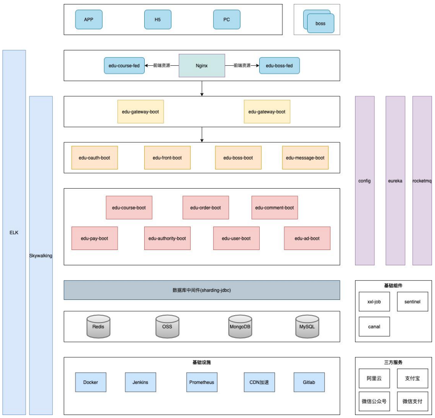
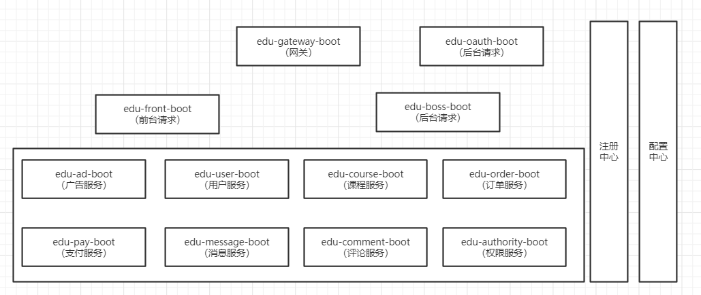
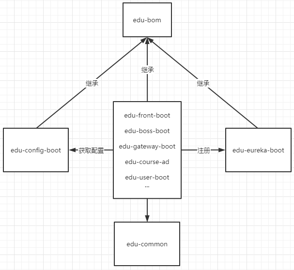

# 第一章 系统架构



- 系统架构图




- 服务关系




# 第二章 开发规约

## 1、服务命名

- MyProject_edu：父工程
- edu-common：公共模块
- edu-eureka-8761：注册中心（测试地址：http://localhost:8761/）
- edu-config-8090：配置中心（测试地址：http://localhost:8090/resume-service-resume-dev.yml）


- edu-gateway-9001：网关（测试地址：http://localhost:9001/boss/ad/getAllAdsBySpaceKey?spaceKey=666）
- edu-front-8081：远程调用-前端统一入口（测试地址：http://localhost:8081/ad/getAllAdsBySpaceKey?spaceKey=666）
- edu-boss-8082：远程调用-后端统一入口（测试地址：http://localhost:8082/ad/getAllAdsBySpaceKey?spaceKey=666）


- edu-ad-8001：广告模块（测试地址：http://localhost:8001/adSpace/getAllSpaces）


## 2、URL 命名

### （1）前端请求

- 协议://主机名/front/模块名/子模块
- 查询：http://xxx.com/front/course/getlist ---get 开头 
- 保存：http://xxx.com/front/course/saveXx ---save 开头 
- 更新：http://xxx.com/front/course/updateXx ---update 开头


### （2）后端请求

- 协议://主机名/boss/模块名/子模块
- 查询：http://xxx.com/boss/course/getlist ---get 开头 
- 保存：http://xxx.com/boss/course/saveXx ---save 开头 
- 更新：http://xxx.com/boss/course/updateXx ---update 开头


## 3、接口响应格式

```java
// content 用于封装业务数据
state 响应码
message 提示信息
{ 
    "content": "自定义业务数据",
    "state": 1, 
    "message": "自定义消息，用于前端显示" 
}
```


# 第三章 技术选型

|              | 框架/组件 | 使用版本 |
| ------------ | --------- | -------- |
| API 接口文档 | Swagger   | 2.9.2    |
|              |           |          |
|              |           |          |


# 第四章 前端项目部署

## 1、安装 nodejs

## 2、安装 git bash

## 3、启动 edu-course-fed

- http://localhost:8088/index.html#/

```bash
git bash here

D:\07_DevCode\TD_MyCode\MyProject_edu\front\edu-course-fed

# 安装依赖
# 执⾏完以后，会多⼀个 node_modules 的⽬录，执⾏该操作主要是引⼊⼀些公共的依赖
cnpm install

# 启动项目
npm run dev
```

## 4、启动  edu-boss-fed

- http://localhost:8080

```bash
git bash here

D:\07_DevCode\TD_MyCode\MyProject_edu\front\edu-boss-fed

# C:\Users\td\.gitconfig 添加下面内容
[url "https://github.com/nhn/raphael.git/"]
insteadOf = git://github.com/nhn/raphael.git/

# 安装依赖
npm install --registry=https://registry.npm.taobao.org

# 启动项目
npm run serve
```


# 第五章 功能模块 - 广告模块 edu-ad-8001

## 1、数据库设计

- promotion_space
- promotion_ad


## 2、功能实现 - 广告位信息

- 新增或者修改广告位信息
- 获取所有广告位信息
- 根据 Id 获取广告位信息


## 3、功能实现 - 广告信息

- 增或者修改广告信息
- 获取所有广告信息
- 根据 spaceKey 获取所有的广告信息（http://localhost:9001/boss/ad/getAllAdsBySpaceKey?spaceKey=888）
- 根据 Id获取广告信息


# 第六章 功能模块 - 用户模块

## 1、数据库设计


